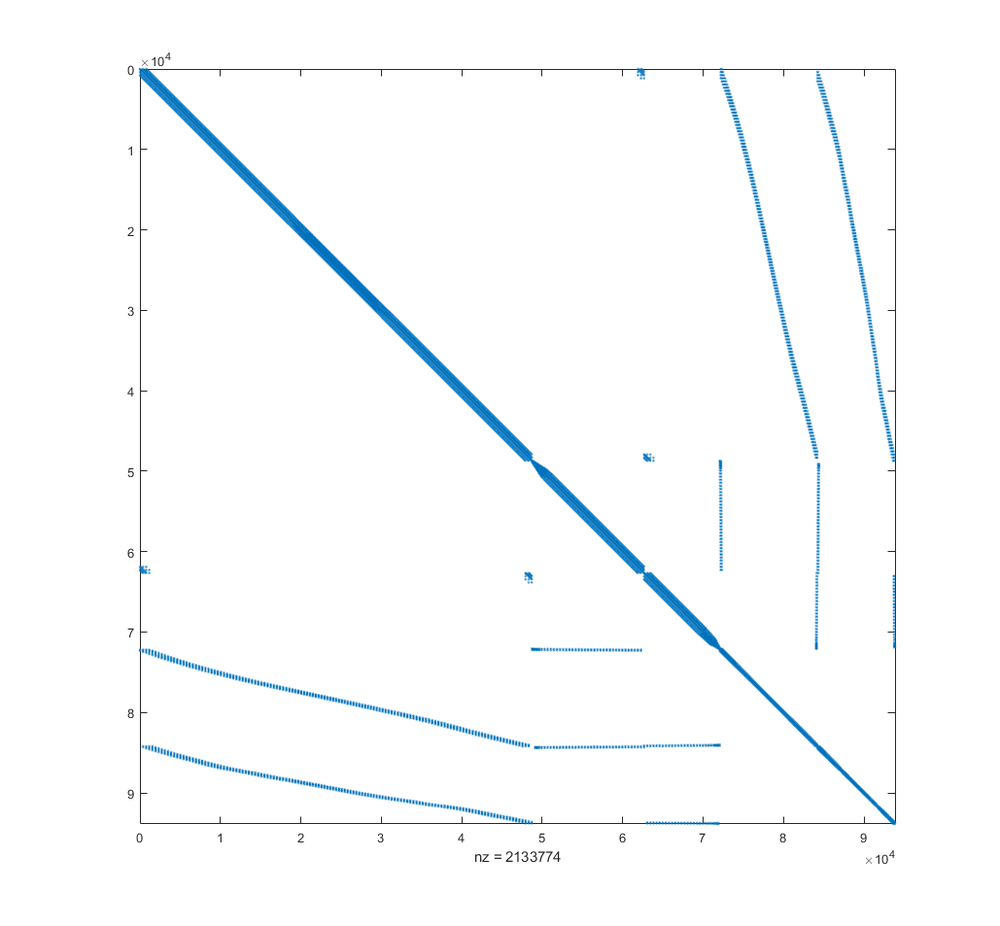

# SpeedTest

**测试目标**

求解 Ax = b 的耗时。

**需要的第三方库**

* Suitesparse
* Intel MKL
* Eigen3
* CUDA

**测试数据**

A 为对称的稀疏矩阵， b为列向量。
通过截取A、b的左上部分得到不同规模的问题。

问题中的A为一个Laplacian矩阵，大小 93864 x 93864 含有2133774个非零元素。 仅有0.02%的元素为非零的。

A中元素分布:


这里只提供了一份数据。如果换用不同的Ab矩阵，结果可能会有较大变化。

**测试方法**

方法|介绍
-|-
PardisoLDLT|Eigen到intel mkl的一个[PARDISO library 接口](http://eigen.tuxfamily.org/dox/classEigen_1_1PardisoLDLT.html)。
SimplicialLDLT|Eigen自己实现的一个[LDLT分解](http://eigen.tuxfamily.org/dox/classEigen_1_1SimplicialLDLT.html)。
UmfPackLU|Eigen到UmfPack的[LU分解接口](http://eigen.tuxfamily.org/dox/classEigen_1_1UmfPackLU.html)
CholmodSupernodalLLT|Eigen到SuiteSparse中[cholmod的接口](http://eigen.tuxfamily.org/dox/classEigen_1_1CholmodSupernodalLLT.html)
ConjugateGradient|Eigen自带的[共轭梯度](http://eigen.tuxfamily.org/dox/classEigen_1_1ConjugateGradient.html)迭代方法
cusolverSpDcsrlsvchol|cusolver中的接口, 用法详见cuda提供的samples

注意事项： 我可能不太清楚这些方法主要针对的是什么问题，所以依旧有可能在使用方法上还未达到最优的结果，但基本上文档提到的使用方法我都遵守了。

**测试效果**

总体来说，CholmodSupernodalLLT最快。

size|CholmodSupernodalLLT|PardisoLDLT|SimplicialLDLT|UmfPackLU|cusolverSpDcsrlsvchol|ConjugateGradient
-|-|-|-|-|-|-
10|3.60E-05|1.90E-04|1.00E-05|4.40E-05|1.93E-03|3.00E-06
100|1.00E-04|1.61E-04|3.00E-05|8.50E-05|2.57E-03|4.00E-05
300|1.39E-04|2.96E-04|5.90E-05|1.93E-04|3.06E-03|1.09E-04
500|2.24E-04|5.13E-04|1.06E-04|3.87E-04|3.98E-03|3.29E-04
700|2.96E-04|6.86E-04|1.59E-04|6.39E-04|4.34E-03|5.50E-04
1000|4.99E-04|1.27E-03|3.08E-04|1.06E-03|5.33E-03|1.47E-03
2600|2.45E-03|5.79E-03|1.66E-03|4.86E-03|1.13E-02|1.49E-02
5000|5.76E-03|1.26E-02|4.85E-03|1.32E-02|2.51E-02|7.60E-02
7400|1.02E-02|2.05E-02|1.14E-02|2.43E-02|5.23E-02|2.09E-01
10000|1.55E-02|2.73E-02|2.27E-02|3.81E-02|1.20E-01|4.91E-01
15000|2.52E-02|4.46E-02|5.37E-02|6.57E-02|2.15E-01|1.30E+00
20000|3.71E-02|6.53E-02|1.00E-01|9.29E-02|5.97E-01|2.35E+00
25000|4.91E-02|8.47E-02|1.36E-01|1.21E-01|9.47E-01|4.09E+00
30000|6.10E-02|1.09E-01|1.92E-01|1.53E-01|1.40E+00|5.64E+00
40000|8.38E-02|1.51E-01|3.73E-01|2.23E-01|3.89E+00|1.06E+01
50000|1.08E-01|1.85E-01|5.27E-01|3.06E-01|4.56E+00|1.67E+01
60000|1.27E-01|2.27E-01|5.57E-01|3.49E-01|4.79E+00|2.31E+01
70000|1.58E-01|2.80E-01|8.71E-01|4.32E-01|6.89E+00|3.85E+01
80000|1.85E-01|3.34E-01|1.03E+00|4.97E-01|7.99E+00|5.88E+01

单位：秒

**要注意的是结果可能与稀疏程度情况有关**，这个测试结果不能代表所有情况，如果需要对新的问题进行测试，可以替换文件spA和b为对应的矩阵内容。

**cholmod与eigen的关系** eigen使用了cholmod的分解，但当时eigen使用的是cpu版本。而印象中eigen并没有提供cholmod的gpu版接口，不知道gpu版本会使效果如何变化。有兴趣后续可以尝试一下。

**矩阵数据格式**

spA: 对称稀疏方阵
```
rows cols
r0 c0 v0
r1 c1 v1
...
rn cn vn
```

b: 列向量
```
v1
v2
...
vn
```

